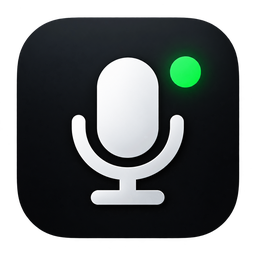
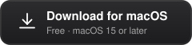
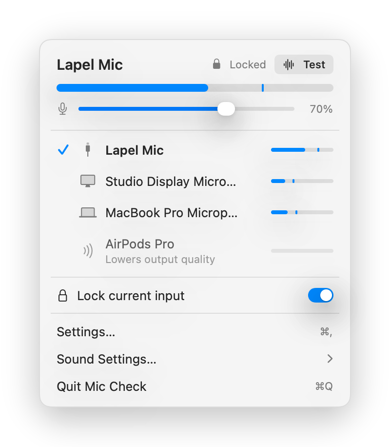

<p align="center">
  
</p>

<h1 align="center">Mic Check</h1>

<p align="center">A small macOS menu bar app for switching your microphone and seeing that it actually hears you.</p>

<p align="center">
  <a href="https://github.com/bryceadams/mic-check-mac/releases/latest/download/Mic-Check.dmg">
    
  </a>
</p>

<p align="center">
  <picture>
    <source media="(prefers-color-scheme: dark)" srcset="docs/panel-dark.png">
    
  </picture>
</p>

---

Switching mics on a Mac means a trip to System Settings, and even then you can't tell whether the mic you picked is live. Mic Check puts the input list one click away in the menu bar, with a live level meter next to every device, so you can see which one is hearing you before you join the call.

## Features

- **One-click input switching.** Every input device in a dropdown, current one checked. Click to make it the system default.
- **Live level meters.** A meter on every row while the panel is open, plus a large meter and gain slider for the current input. The menu bar icon fills with level too.
- **Sound test.** Click **Test** to record five seconds and hear it played back through your speakers. Press and hold to record for as long as you hold, up to a minute.
- **Lock input.** Stop macOS or other apps from silently switching your mic. When locked, Mic Check switches it straight back.
- **Rename and hide devices.** Right-click any row to give a device a friendly name ("Lapel mic" instead of "USB Audio Device") or hide it. Virtual devices from meeting apps are hidden by default, and the iPhone Continuity mic is never listed.
- **Stays out of the way.** No Dock icon, no windows, and no microphone use while the panel is closed.
- **Updates itself.** Checks once a day and offers new versions in place, via Sparkle. Turn it off in Settings if you prefer.

## Install

[Download the latest DMG](https://github.com/bryceadams/mic-check-mac/releases/latest/download/Mic-Check.dmg), open it, and drag Mic Check to Applications. Older versions are under [Releases](https://github.com/bryceadams/mic-check-mac/releases). The app is signed and notarized, so it opens without warnings.

Requires macOS 15 or later. On first open of the panel, macOS asks for microphone access. That's needed for the level meters; nothing is recorded or stored.

Turn on **Launch at login** in Settings if you want it always there.

## Privacy

Mic Check makes one kind of network request: a daily check of the update feed on GitHub, which you can turn off in Settings. Audio from your microphones is used only to draw the meters and, when you run a sound test, to play the clip back to you from memory. Nothing is written to disk or sent anywhere. Preferences and device names are stored locally in the app's own defaults.

## Building from source

Requirements: Xcode 16 or later and [XcodeGen](https://github.com/yonaskolb/XcodeGen) (`brew install xcodegen`). The only dependency, [Sparkle](https://sparkle-project.org), is fetched by Swift Package Manager on first build.

```bash
xcodegen generate
xcodebuild -project MicCheck.xcodeproj -scheme MicCheck -configuration Debug -derivedDataPath build build
open "build/Build/Products/Debug/Mic Check.app"
```

The project is described in `project.yml`; the generated `.xcodeproj` is not checked in. Signing uses a Developer ID identity, so set your own team in `project.yml` or switch `CODE_SIGN_STYLE` to `Automatic` to build with a development certificate.

`scripts/release.sh` builds a Release binary, notarizes it, packages a DMG, and regenerates `appcast.xml`, the feed installed copies poll for updates. With `--publish` it also creates the GitHub release. See the comments at the top of that script for the one-time credential setup.

The README screenshots are rendered by the app itself from example data: run the built binary with `--render-screenshots <directory>`.

## How it works

Device enumeration, default-input switching, and gain use the CoreAudio HAL directly. Each level meter is a CoreAudio IO proc on its device, started only while the panel is open. The dropdown is a SwiftUI `MenuBarExtra` in window style. Sparkle handles updates; there are no other dependencies.

## License

[MIT](LICENSE)
